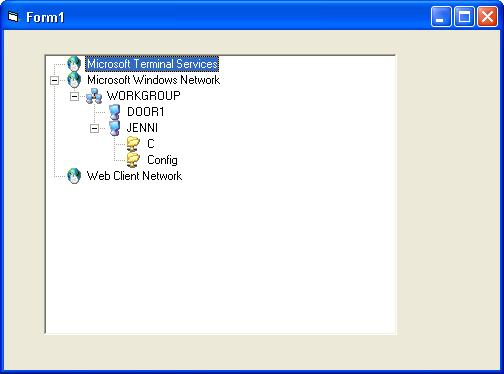



## Enumerate network resources

### Description

Enumerate network resources - get computer, domain and share names on your lan network, works with xp. Having looked at Mark van Renswoude's code for "Show all Domains and Computers in LAN" that didn't work with XP because of the way it didn't recursively find each network resource, I have written this for those out there who need this! This example is simple and contains only 5 api calls and 4 short functions, easy to add to your own applications and there are no bugs! If you like please vote.
 
### More Info
 

             |
---                |---
**Submitted On**   |2004-06-07 19:05:02
**By**             |[James Gohl](https://github.com/Planet-Source-Code/PSCIndex/blob/master/ByAuthor/james-gohl.md)
**Level**          |Intermediate
**User Rating**    |5.0 (20 globes from 4 users)
**Compatibility**  |VB 5\.0, VB 6\.0
**Category**       |[Miscellaneous](https://github.com/Planet-Source-Code/PSCIndex/blob/master/ByCategory/miscellaneous__1-1.md)
**World**          |[Visual Basic](https://github.com/Planet-Source-Code/PSCIndex/blob/master/ByWorld/visual-basic.md)
**Archive File**   |[Enumerate\_175495672004\.zip](https://github.com/Planet-Source-Code/james-gohl-enumerate-network-resources__1-54243/archive/master.zip)

